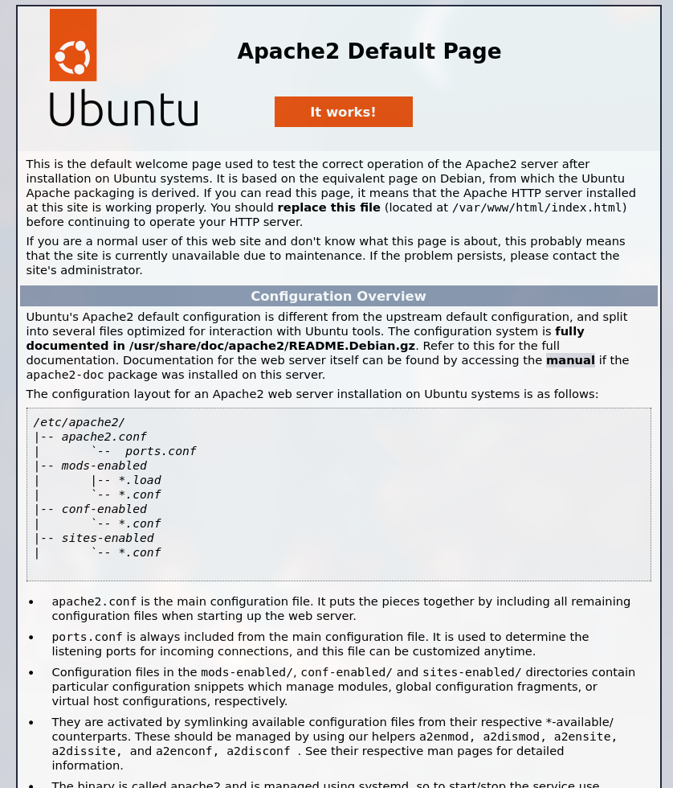

# Лабораторная работа номер 4

## Студент: Кроитор Александр

## Группа: IA2403

## Преподаватель: M. Croitor

## Дата: 12-02-2026

## Цель работы: _Данная лабораторная работа призвана напомнить основные команды ОС Debian/Ubuntu. Также она позволит познакомиться с **Docker** и его основными командами._

## Задание: _Запустить контейнер **Ubuntu**, установить Web-сервер **Apache** и вывести в браузере страницу с текстом "Hello, World!"._

### Важно!

Так как Podman является более легковесной версией Docker и работает с аналогичным API, что и Docker, то использоваться будет именно он. Он быстрее, легче, rootless (отчего безопаснее), а также работает без демона, в отличие от Docker (и поддерживает Compose), также совместим с K8s

Так как мы используем Podman, то ~~ubuntu~~ **docker.io/library/ubuntu**

```bash
podman run -ti -p 8000:80 --name containers04 docker.io/library/ubuntu bash
```

```bash
Trying to pull docker.io/library/ubuntu:latest...
Getting image source signatures
Copying blob a3629ac5b9f4 done   |
Copying config 493218ed0f done   |
Writing manifest to image destination
root@d3fb15ddf503:/#
```

Видно, что без явного обозначения версии Ubuntu, мы переходим в версию latest, то есть версия 24.04, Noble, что на самом деле не совсем хорошо, по следующим причинам:

- В docker.io/library/ubuntu:latest тег **latest** указывает на последнюю официально поддерживаемую **LTS** или текущую стабильную
  версию Ubuntu на момент сборки. Сейчас это Ubuntu 24.04 (Noble). Но через год или два latest может уже указывать на новую LTS, например
  26.04. Поэтому, если не зафиксировать версию (ubuntu:24.04), сборка и запуск контейнера в будущем могут неожиданно получить другую базу,
  что приведёт к несовместимостям с пакетами.- В контексте одной версии пакета ubuntu в течение времени - пакеты могут изменять состояние,
  мы не можем фиксировать их версию.
- Даже фиксируя базовую версию Ubuntu, пакеты внутри (apt install) могут обновляться при сборке. Например, apt-get install python3 может
  подтянуть более новую минорную версию, чем та, что была изначально. Чтобы полностью зафиксировать окружение, используют:
  - Теги с конкретной версией (например ubuntu:24.04)

  - Фиксацию версий пакетов (apt-get install python3=3.12.0-1ubuntu1)

  - Использование lock-файлов / snapshot-репозиториев для reproducible builds.

Отсюда выводы по использованию контейнеров:

- Никогда не полагаться на latest в production.

- Всегда явно указывать версию базового образа.

- По возможности фиксировать версии ключевых пакетов, чтобы сборка была воспроизводимой.

По сути, Dockerfile корректнее называть **Repeatable**, чем **Reproducible** в этом конкретном контексте, так как даже тег версии является мутабельным указателем и не гарантирует точную воспроизводимость на уровне коммита, а транзитивные зависимости подтягиваются из текущих версий репозиториев, но не будем углубляться в это слишком глубоко

Запустим следующие команды для установки и запуска Apache2 (веб-сервер, принимает запросы, отдаёт веб-страницы):

```bash
apt update
apt install apache2 -y
service apache2 start
```

Вкратце:

- apt - пакетный менеджер (используется для контроля пакетами, пакеты - архивы с программами/библиотеками)
- service - в systemd-системах перенаправляет вызовы на systemctl для запуска сервисов/скриптов, но так как мы в контейнере, service работает через скрипты init

Здесь мы видим классическое обновление списка пакетов:

```bash
Get:1 http://security.ubuntu.com/ubuntu noble-security InRelease [126 kB]
Get:2 http://archive.ubuntu.com/ubuntu noble InRelease [256 kB]
Get:3 http://security.ubuntu.com/ubuntu noble-security/restricted amd64 Packages [3106 kB]
Get:4 http://archive.ubuntu.com/ubuntu noble-updates InRelease [126 kB]
Get:5 http://archive.ubuntu.com/ubuntu noble-backports InRelease [126 kB]
Get:6 http://archive.ubuntu.com/ubuntu noble/restricted amd64 Packages [117 kB]
Get:7 http://archive.ubuntu.com/ubuntu noble/multiverse amd64 Packages [331 kB]
Get:8 http://archive.ubuntu.com/ubuntu noble/main amd64 Packages [1808 kB]
Get:9 http://security.ubuntu.com/ubuntu noble-security/multiverse amd64 Packages [34.8 kB]
Get:10 http://security.ubuntu.com/ubuntu noble-security/universe amd64 Packages [1199 kB]
Get:11 http://security.ubuntu.com/ubuntu noble-security/main amd64 Packages [1822 kB]
Get:12 http://archive.ubuntu.com/ubuntu noble/universe amd64 Packages [19.3 MB]
Get:13 http://archive.ubuntu.com/ubuntu noble-updates/restricted amd64 Packages [3287 kB]
Get:14 http://archive.ubuntu.com/ubuntu noble-updates/universe amd64 Packages [1978 kB]
Get:15 http://archive.ubuntu.com/ubuntu noble-updates/multiverse amd64 Packages [38.1 kB]
Get:16 http://archive.ubuntu.com/ubuntu noble-updates/main amd64 Packages [2201 kB]
Get:17 http://archive.ubuntu.com/ubuntu noble-backports/universe amd64 Packages [34.6 kB]
Get:18 http://archive.ubuntu.com/ubuntu noble-backports/main amd64 Packages [49.5 kB]
Fetched 36.0 MB in 4s (8420 kB/s)
Reading package lists... Done
Building dependency tree... Done
Reading state information... Done
4 packages can be upgraded. Run 'apt list --upgradable' to see them.
```

Полный вывод скачивания пакета Apache2 я показывать не буду, он достаточно громоздкий.

Запускаем сам Apache2 сервис:

```bash
root@d3fb15ddf503:/# root@d3fb15ddf503:/# service apache2 start
 * Starting Apache httpd web server apache2AH00558: apache2: Could not reliably determine the server's fully qualifieddomain name, using 192.168.100.5. Set the 'ServerName' directive globally to suppress this message
 *
```

Видим предупреждение о том, что Apache2 не знает своего доменного имени и подставляет локальный IP вместо имени сервиса. Давайте в качестве наглядности изменим это и поменяем имя сервера на localhost. Делается это элементарно, но так как мы обладаем почти чистой системой Ubuntu, то никаких nano у нас нет, поэтому это будет нагляднее.

#### ВАЖНО: Технически, следующие действия могут показаться бессмысленными, так как localhost и так резолвится на локальном IP, однако явное указание рабочего IP делает конфигурацию детерминированной и очевидной. Ну и плюс мне хотелось немного почитать про Apache2 и его настройку.

Вот первые строки конфигурации

```conf
# This is the main Apache server configuration file.  It contains the
# configuration directives that give the server its instructions.
# See http://httpd.apache.org/docs/2.4/ for detailed information about
# the directives and /usr/share/doc/apache2/README.Debian about Debian specific
# hints.
#
```

Много информации, но она нам особо не нужна, единственное что нам необходимо это добавить

```conf
ServerName localhost
```

В конец файла:

```bash
echo 'ServerName localhost' >> /etc/apache2/apache2.conf
```

Очень важно, что `>` перезаписывает, а `>>` добавляет строку.
`echo` является инструментом создания текста, операторы оболочки `<`, `>`, `<<`, `>>`, `||`, `&&` и другие используются для перенаправления потоков текста (stdin, stdout, stderr)

```bash
root@d3fb15ddf503:/# tail -2 /etc/apache2/apache2.conf
IncludeOptional sites-enabled/*.conf
ServerName localhost
root@d3fb15ddf503:/#
```

```bash
root@d3fb15ddf503:/# service apache2 stop

- Stopping Apache httpd web server apache2 \*
  root@d3fb15ddf503:/# service apache2 start
- Starting Apache httpd web server apache2 \*
```

Открыв http://localhost:8000, мы видим базовое приветствие apache2



Далее, согласно заданию, посмотрим, что у нас там такого в /var/www/html (помним, что var от слова variable, там у нас обычно меняющиеся данные от сервисов):

```bash
root@d3fb15ddf503:/# ls /var/www/html/
index.html
```

Этот index.html был создан автоматически Apache2 при его установке (не запуске).
Это подтверждается моим скриптом:

```bash
root@d3fb15ddf503:/# cat /var/www/html/index.html | grep Apache2
    <title>Apache2 Ubuntu Default Page: It works</title>
            Apache2 Default Page
                operation of the Apache2 server after installation on Ubuntu systems.
                Ubuntu's Apache2 default configuration is different from the
                The configuration layout for an Apache2 web server installation on Ubuntu systems is as follows:
                Apache2 package with Ubuntu. However, check <a
```

Давайте теперь перезапишем файл, вставив в него кастомный HTML:

```bash
echo '<h1> Use nginx Please </h1>' > /var/www/html/index.html
```

Теперь на http://localhost:8000 у нас наш кастомный HTML


Переходим в директорию с доступными сайтами:

```bash
root@d3fb15ddf503:/# cd /etc/apache2/sites-enabled/
root@d3fb15ddf503:/etc/apache2/sites-enabled# ls
000-default.conf
root@d3fb15ddf503:/etc/apache2/sites-enabled# cat 000-default.conf
<VirtualHost *:80>
	# The ServerName directive sets the request scheme, hostname and port that
	# the server uses to identify itself. This is used when creating
	# redirection URLs. In the context of virtual hosts, the ServerName
	# specifies what hostname must appear in the request's Host: header to
	# match this virtual host. For the default virtual host (this file) this
	# value is not decisive as it is used as a last resort host regardless.
	# However, you must set it for any further virtual host explicitly.
	#ServerName www.example.com

	ServerAdmin webmaster@localhost
	DocumentRoot /var/www/html

	# Available loglevels: trace8, ..., trace1, debug, info, notice, warn,
	# error, crit, alert, emerg.
	# It is also possible to configure the loglevel for particular
	# modules, e.g.
	#LogLevel info ssl:warn

	ErrorLog ${APACHE_LOG_DIR}/error.log
	CustomLog ${APACHE_LOG_DIR}/access.log combined

	# For most configuration files from conf-available/, which are
	# enabled or disabled at a global level, it is possible to
	# include a line for only one particular virtual host. For example the
	# following line enables the CGI configuration for this host only
	# after it has been globally disabled with "a2disconf".
	#Include conf-available/serve-cgi-bin.conf
</VirtualHost>
root@d3fb15ddf503:/etc/apache2/sites-enabled#
```

Важные моменты здесь это:

- ```conf
    <VirtualHost *:80>
  ```

  - `*` любой сетевой адрес, который есть на машине, включая внешние IP-адреса
  - 80 - порт на который слушается веб сервис (так как мы запустили -p 8000:80, то 80 порт в контейнере будет прокидываться на 8000 (это работает обычно наоборот, запрос на http://localhost:8000 будет перенаправляться на 80 порт внутри контейнера))

- ```conf
  ServerAdmin webmaster@localhost
  ```

  - по сути это email, который Apache будет показывать пользователю в случае ошибок сервера
  - webmaster@localhost - адрес по умолчанию

* ```conf
  DocumentRoot /var/www/html
  ```

  - каталог, где находятся файлы сайта, которые Apache отдает клиентам
  - по умолчанию `/var/www/html` создается при установке пакета Apache
  - можно менять на любой другой путь, если нужно хранить сайт в другом месте

* ```conf
  ErrorLog ${APACHE_LOG_DIR}/error.log
  ```

  - файл, куда Apache записывает **ошибки сервера**
  - `${APACHE_LOG_DIR}` обычно указывает на `/var/log/apache2`
  - здесь фиксируются ошибки конфигурации, модулей и обработка запросов, полезно для диагностики

```bash
root@d3fb15ddf503:/etc/apache2/sites-enabled# ls /var/log/apache2/
access.log  error.log  other_vhosts_access.log
```

- ```conf
  CustomLog ${APACHE_LOG_DIR}/access.log combined
  ```

  - файл, куда Apache записывает **запросы клиентов (access log)**
  - `combined` — стандартный формат логов, включает IP клиента, время запроса, URL, код ответа, браузер и реферер
  - полезно для анализа трафика, статистики и отладки

Выходим из контейнера:

```bash
root@d3fb15ddf503:/etc/apache2/sites-enabled# exit
exit
```

Смотрим список всех контейнеров (-a отвечает за all, иначе показываются только запущенные)

```bash
podman ps -a
CONTAINER ID  IMAGE                                                   COMMAND               CREATED            STATUS                           PORTS                   NAMES
342f1eecea35  docker.io/library/postgres:18                           postgres              6 days ago         Exited (0) 6 days ago            0.0.0.0:5432->5432/tcp  basketball-database
71e7ec8832cd  localhost/basketball_analyser_basketball-parser:latest  python -m src.api...  6 days ago         Exited (1) 6 days ago            0.0.0.0:8000->8000/tcp  basketball-parser
ca1a017c152c  localhost/basketball_analyser_basketball-live:latest    /app/app              6 days ago         Exited (0) 6 days ago                                    basketball-live
9e5a980b3049  localhost/containers03:latest                           bash                  4 days ago         Exited (127) 4 days ago                                  containers03
d0403e42062f  docker.io/library/postgres:16                           postgres              2 days ago         Exited (0) 2 days ago            0.0.0.0:5432->5432/tcp  postgres
d3fb15ddf503  docker.io/library/ubuntu:latest                         bash                  About an hour ago  Exited (127) About a minute ago  0.0.0.0:8000->80/tcp    containers04
```

У меня много контейнеров тут, для удаления одного можно использовать

```bash
podman rm containers04
```

После чего контейнер удаляется:

```bash
 podman rm containers04

containers04

 podman ps -a
CONTAINER ID  IMAGE                                                   COMMAND               CREATED     STATUS                   PORTS                   NAMES
342f1eecea35  docker.io/library/postgres:18                           postgres              6 days ago  Exited (0) 6 days ago    0.0.0.0:5432->5432/tcp  basketball-database
71e7ec8832cd  localhost/basketball_analyser_basketball-parser:latest  python -m src.api...  6 days ago  Exited (1) 6 days ago    0.0.0.0:8000->8000/tcp  basketball-parser
ca1a017c152c  localhost/basketball_analyser_basketball-live:latest    /app/app              6 days ago  Exited (0) 6 days ago                            basketball-live
9e5a980b3049  localhost/containers03:latest                           bash                  4 days ago  Exited (127) 4 days ago                          containers03
d0403e42062f  docker.io/library/postgres:16                           postgres              2 days ago  Exited (0) 2 days ago    0.0.0.0:5432->5432/tcp  postgres
```

Для удаления всех контейнеров можно использовать -a

```bash
 podman rm -a
ca1a017c152c59b36e4e6aab93f5e1f4901a86f5e3c0395134be6ff18c68eb78
9e5a980b30494588caaf94d657e560ecd75765993a127b076d751c5a929e8010
d0403e42062fea6a6f897f972a4f3f45bd38863e3e241e133cd652a6d58cd20f
71e7ec8832cdbd557b833ea230c3cefe547769f3f93d46776bfa8a2701e2f2a1
342f1eecea353e3dc0273a5bf52c2a29307e98e3b3fa1b44363d88abc0df1c9c
```

#### Выводы:

1. Контейнеризация:
   - Контейнеры позволяют запускать изолированные окружения с конкретными версиями ОС и приложений.
   - Порт -p <host>:<container> обеспечивает доступ к сервису из хоста, при этом контейнер слушает свой внутренний порт.
2. Конфигурация сервера:
   - Директива ServerName задаёт имя сервера для корректной генерации URL и устранения предупреждений.
   - DocumentRoot указывает на каталог сайта, где располагаются файлы, отдаваемые сервером.
   - ErrorLog и CustomLog важны для мониторинга и диагностики работы сервера.
